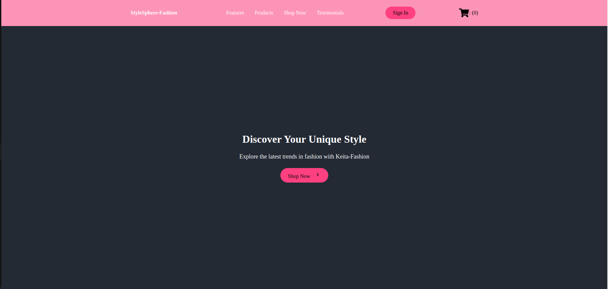

# StyleSphere-Fashion E-Commerce Platform

## Table of Contents
1. [Project Overview](#project-overview)
2. [Features](#features)
3. [Technology Stack](#technology-stack)
4. [Core Algorithms](#core-algorithms)
5. [Installation and Setup](#installation-and-setup)
6. [API Endpoints](#api-endpoints)
7. [Usage](#usage)
8. [Challenges Overcome](#challenges-overcome)
9. [Learnings and Insights](#learnings-and-insights)
10. [Contributing](#contributing)
11. [License](#license)
12. [Contact](#contact)

# Project Overview

StyleSphere-Fashion is a full-stack e-commerce platform built to showcase and sell fashion products. It allows users to browse a collection of fashion items, add them to their cart, and proceed to checkout. The platform includes user authentication for signing up, logging in, and maintaining personalized shopping experiences.

________________________________________________________________

# Features
* **User Authentication**: Secure registration and login with token-based authentication.
* **Product Display**: Browse products with details such as images, names, descriptions, and prices.
* **Cart Functionality**: Add products to a cart, view the cart, and calculate the total price dynamically.
* **Checkout Process**: Proceed with the checkout process for purchasing items in the cart.
* **Responsive Design**: Fully responsive and mobile-friendly using styled-components.
* **Error Handling**: Graceful error handling and form validation.

# Technology Stack

### Frontend:
* **React**: For building the user interface.
* **Styled-Components**: CSS-in-JS for responsive and modular styling.
* **React Icons**: Used for various icons, such as the cart icon.
* **Fetch API**: For handling HTTP requests to the backend.

### Backend:
* **Django**: For building the backend API and handling data.
* **Django Rest Framework (DRF)**: For creating the RESTful API and token-based authentication.
* **SQLite/PostgreSQL**: Database to store users and product information.

# Installation

### Prerequisites:

* **Node.js**: Make sure you have Node.js installed.
* **Python**: Python 3.x version is required for the Django backend.

## Backend Setup (Django):

1. Clone the repository:
    ```bash
    git clone https://github.com/modibokeita/my-alx-portfolio
    cd my-alx-portfolio
    ```

2. Create a virtual environment and activate it:
    ```bash
    python -m venv venv
    source venv/bin/activate  # On Windows use `venv\Scripts\activate`
    ```

3. Install dependencies:
    ```bash
    pip install -r requirements.txt
    ```

4. Run migrations:
    ```bash
    python manage.py migrate
    ```

5. Start the Django development server:
    ```bash
    python manage.py runserver
    ```

## Frontend Setup (React):

1. Navigate to the frontend directory:
    ```bash
    cd online-shop
    ```

2. Install dependencies:
    ```bash
    npm install
    ```

3. Start the React development server:
    ```bash
    npm start
    ```
# The Homepage Of App


